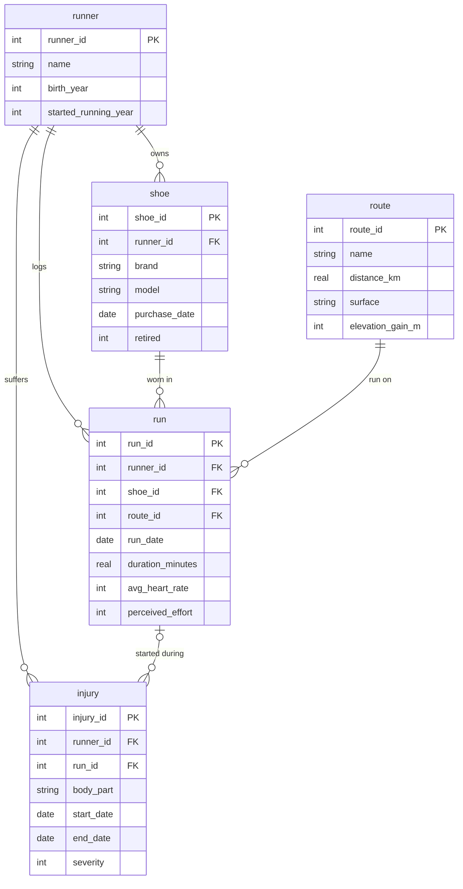

# Schema (Mermaid ER diagram — renders on GitHub)

```mermaid
erDiagram
    runner ||--o{ shoe : owns
    runner ||--o{ run : logs
    shoe ||--o{ run : "worn in"
    route ||--o{ run : "run on"
    runner ||--o{ injury : suffers
    run |o--o{ injury : "started during"
    runner { int runner_id PK
        string name
        int birth_year
        int started_running_year }
    shoe { int shoe_id PK
        int runner_id FK
        string brand
        string model
        date purchase_date
        int retired }
    route { int route_id PK
        string name
        real distance_km
        string surface
        int elevation_gain_m }
    run { int run_id PK
        int runner_id FK
        int shoe_id FK
        int route_id FK
        date run_date
        real duration_minutes
        int avg_heart_rate
        int perceived_effort }
    injury { int injury_id PK
        int runner_id FK
        int run_id FK
        string body_part
        date start_date
        date end_date
        int severity }
```
